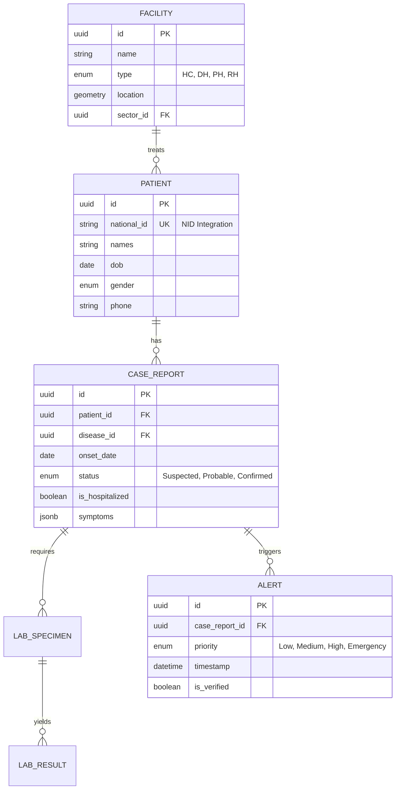

# TECHSTACK AND DB SCHEMAS

---

## 1. Database Schema (ERD)

The core of RIDSR is **Interoperability**. We use **PostgreSQL with PostGIS** for spatial tracking.

> **Note:** The `national_id` is crucial for de-duplication across Rwanda's health centers.

---

## 2. Technical Stack: The "Rwanda Standard"

To meet **RISA (Rwanda Information Society Authority)** hosting and data sovereignty standards:

* **Frontend:** **Next.js 14+ (App Router)**.
* *Why:* Fast SSR for dashboards and built-in PWA support for health workers in rural areas with poor 4G.

* **Backend:** **Node.js (NestJS)** or **Go**.
* *Why:* NestJS provides a structured, enterprise-grade architecture that is easy for MoH teams to maintain long-term.

* **Database:** **PostgreSQL + PostGIS**.
* *Why:* To visualize disease clusters across Rwanda's 30 districts and 416 sectors.

* **Real-time:** **Socket.io** or **WebSockets** for the National Command Center's live alert feed.
* **Interoperability:** **HL7 FHIR API** (Standard for sharing data with OpenMRS/DHIS2).

---

## 3. Core Features & Pages

### A. The "Smart" Triage (For Nurses/CHWs)

* **Dynamic Form Engine:** Instead of a 12-page paper form, use a "stepper" UI. If a user selects "Fever," the system automatically asks about "Bleeding" or "Rashes" (Condition-based logic).
* **Offline Mode:** Uses **Service Workers** and **IndexedDB**. If a CHW is in a valley with no signal, the report is saved and auto-uploads once they reach a hilltop or the Health Center.

### B. The Outbreak Command Center (For RBC/Epidemiologists)

* **Threshold Engine:** A backend service that calculates **Incidence Rates**. If  cases occur in a specific village within  days, the district turns **RED** on the dashboard.
* **Specimen Tracking:** A "Track & Trace" system for lab samples being moved from rural districts to the **National Reference Lab (NRL)** in Kigali.

### C. Automated Reporting

* **One-Click Weekly Bulletin:** Automatically aggregates all district data into a PDF epidemiological bulletin every Sunday at midnight.

---

## 4. Role-Based Access Control (RBAC)

Rwanda’s health system is hierarchical. Your RBAC must follow this "Pyramid."

| Role | Access Level | Responsibilities |
| --- | --- | --- |
| **CHW (Abajyanama)** | Village | Submit signals, see their own village's status. |
| **Nurse (HC Focal Person)** | Health Center | Complete case reports, view facility trends. |
| **District Health Officer** | District | Verify alerts, manage local logistics (Ambulances/PPE). |
| **RBC Epidemiologist** | National | National heatmaps, data export for WHO, policy setting. |
| **Admin** | System | Manage users, update disease thresholds (e.g., COVID to Marburg). |

---

## 5. Implementation Phases (The Roadmap)

### Phase 1: The "Digital Spine" (Month 1-3)

* Build the **FHIR-compliant API** and the **Patient Identity Module** (NID Integration).
* Create the core reporting interface for the 502 Health Centers.

### Phase 2: The "Verification Loop" (Month 4-5)

* Build the **Lab Integration Module**.
* Develop the **District Approval Workflow** (where DHOs verify suspected cases).

### Phase 3: The "Intelligence Layer" (Month 6+)

* Launch the **GIS Dashboards** and **Automated SMS Alerts**.
* Pilot in 3 districts (e.g., Kigali, Musanze, and a border district like Rubavu).

---

## 6. Primary API Endpoints (Samples)

* `POST /api/v1/cases/report`: Submit a new suspected case (Supports offline ID).
* `GET /api/v1/alerts/active`: Live feed of unverified alerts for District Officers.
* `GET /api/v1/analytics/map?disease_id={id}`: Returns GeoJSON data for the national heatmap.
* `PATCH /api/v1/lab/results/{specimen_id}`: Allows NRL to update case status to "Confirmed."

### 7. The "No-Noise" Modern Design Stack

1. **Framework:** Next.js 14+ (App Router).
2. **UI Components:** **Shadcn/UI** (Built on Radix UI) – extremely clean, accessible, and easy to customize for MoH branding.
3. **Icons:** **Lucide-React** (Simple, thin-line icons that load fast).
4. **Charts:** **Recharts** or **Tremor.so** (Tremor is specifically designed for dashboards).
5. **Maps:** **Mapbox GL JS** or **Leaflet** with Rwanda Sector-level GeoJSON.
