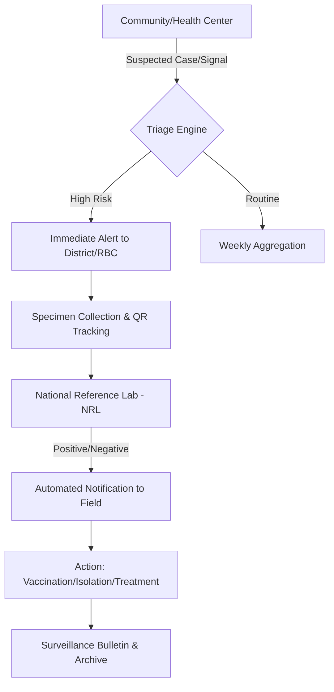

### 1. The RIDSR "Signal-to-Action" Flow

The following diagram illustrates the end-to-end data lifecycle in the RIDSR ecosystem.

---

### 2. End-to-End Feature List & User Stories

#### A. Community & Facility Module (The "Frontline")

**Features:**

* **NID Integration:** Search and auto-fill patient demographics using the Rwanda National ID API.
* **Dynamic Syndromic Triage:** A form that adapts based on inputs (e.g., selecting "Fever" opens specific sub-questions for Malaria, Ebola, or Meningitis).
* **Offline-First Reporting:** PWA-based forms that save data to `IndexedDB` when 4G signal is lost and auto-sync when back online.

**User Story:** > *As a Community Health Worker (Abajyanama b’Ubuzima), I want to report a cluster of sudden deaths in my village using a simple Kinyarwanda mobile interface, even without an internet connection, so that the Ministry is alerted within seconds instead of days.*

#### B. Laboratory & Specimen Module (The "Confirmer")

**Features:**

* **QR Code Lab Tracking:** Generates unique tracking IDs for blood/swab samples to ensure the physical vial matches the digital record.
* **LIMS Interoperability:** A standard HL7/FHIR interface to push results from the National Reference Lab back to the patient's case file.

**User Story:**

> *As a Lab Technician at a District Hospital, I want to scan a QR code on a sample vial to instantly pull up the patient’s suspected case file and enter results, so that the District Health Officer gets an automated "Confirmed" notification.*

#### C. National Command Center (The "Decision Maker")

**Features:**

* **Automated Epi-Curves:** Real-time charting of disease incidence ().
* **Threshold Alert System:** A backend engine that triggers SMS/Push notifications if cases in a specific Sector exceed the historical 5-year average.
* **GIS Heatmapping:** Interactive maps of Rwanda's 30 districts and 416 sectors using PostGIS spatial data.

**User Story:**

> *As an RBC Epidemiologist, I want to see a national heatmap that turns red when a "trigger" disease threshold is met in a border district, so I can dispatch a Rapid Response Team (RRT) immediately.*

---

### 3. Page Inventory & Components

| Page Name | Key Components | Core Forms/UI Elements |
| --- | --- | --- |
| **Login/Auth** | Multi-Factor Auth (MFA), Role Selector | RBAC-based login (Facility, District, National). |
| **Patient Intake** | NID Search Bar, Demographic Card | "Register New Patient" Form (NID, Location, Gender, Age). |
| **Case Report** | Symptom Stepper, Logic Engine | "IDSR Weekly/Immediate Form" (Priority Disease dropdown, Onset Date). |
| **Lab Portal** | QR Scanner, Results Grid | "Specimen Intake" Form, "Result Verification" Modal. |
| **National Map** | Mapbox/Leaflet GIS, Filter Sidebar | Choropleth Map of Rwanda, Sector-level drill-down. |
| **Alerts Center** | Notification Feed, Priority Badges | "Alert Verification" Workflow (Verify / Dismiss / Investigate). |
| **Bulletins** | PDF Generator, Chart Export | "One-Click Weekly Epi-Bulletin" generator. |

---

